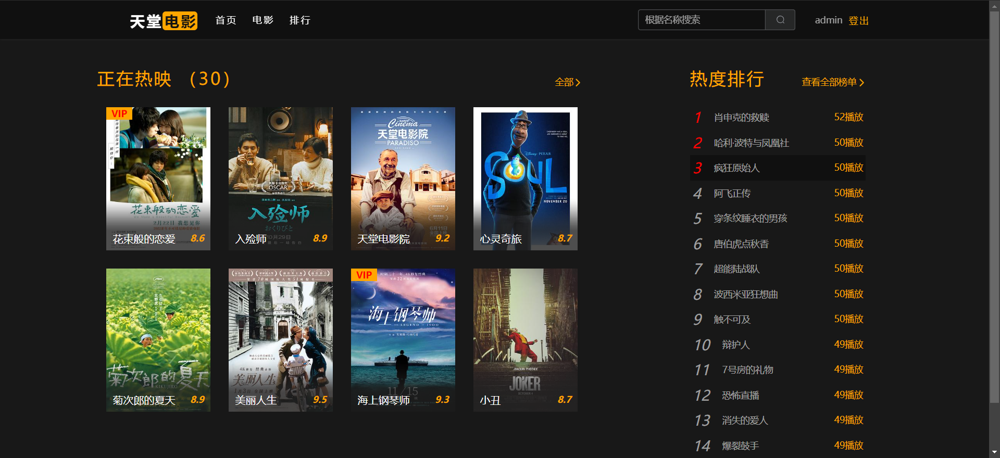

## 开发与运行环境
- JDK 11
- node v18.15.0
- redis（默认端口）
- mysql8.0（默认端口）


## 数据源

- 豆瓣Top250


## 快速开始

### 后端部分

1. 导入`movie-back/sql-init/movie.sql`数据库表
2. 使用IDEA打开`movie-back/`
3. 根据注释，更改`src/resources/application.yml`的`spring.datasource`配置
4. 启动SpringBoot服务，默认端口为`8080`

### 前端部分

1. 命令行打开`movie-front/`
2. 通过npm初始化
   ```shell
   npm i
   ```
3. 启动
   ```shell
   npm run dev
   ```


## TODO

包含至少8个响应式页面：

- [x] 1.登录页
- [x] 2.首页
- [x] 3.排行页
- [x] 4.电影库页
- [x] 5.详情页
- [x] 6.播放页
- [x] 7.用户页
- [ ] 8.数据报表页？


## 预览


